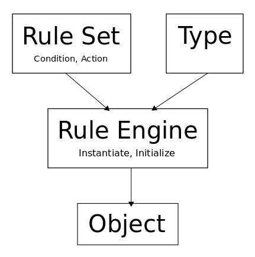

# Rule Based Object (RBO) Initialization

Unit or integration testing often require the use of complex objects that are fake but look realistic.

Such objects can be constructed using creational patterns but they all require coding. An alternative is to use an engine and a set of rules to create the object.

The solution contains both a local library (RBOLib) and a web service (RBOService, RBOClientLib) to achieve the same goal, the former uses reflection and the latter json object and array manipulation.

The process of initialization can be summarized in the following diagram:

<div style="text-align: left"></div>

The rule "condition" is reduced to a regular expression matching the object property path and the "action" assigns a value to the property that matches the condition.
Actions are defined by assignment type and parameters.

The interface for sending a rule to the engine is:
```C#
public void AddRule(
    string pattern, 
    SourceTypeEnum source, 
    params object[] parameters
)
``` 
The supported assignment actions are:
* Value - first parameter
* Sequence - value is incremented for every instance
* Random - random value between limits 
* Array - value selected from elements of array

# Example
The best way to understand how this works is by a simple example.

Lets suppose we have two classes Pet and Owner and an owner has many pets.
```C#
class Pet
{
    public int Id { get; set; }
    public string Name { get; set; }
    public string Species { get; set; }
    public int Age { get; set; }
    public bool IsTrained { get; set; }
}

class Owner
{
    public int Id { get; set; }
    public string Name { get; set; }
    public Pet[] Pets { get; set; }
}
```
The following code:
```C#
RBO.AddRule("Id", SourceTypeEnum.Sequence);
RBO.AddRule("Name", SourceTypeEnum.Array, "Paul", "John");
RBO.AddRule("Pets.Length", SourceTypeEnum.Value, 3);
RBO.AddRule("Pets[].Name", SourceTypeEnum.Array, "Rocky", "Coco");
RBO.AddRule("Species", SourceTypeEnum.Array, "Dog", "Cat", "Fish");
RBO.AddRule("Age", SourceTypeEnum.Random, 1, 10);
RBO.AddRule("IsTrained", SourceTypeEnum.Array, true, false);
var owner = RBO.Create<Owner>();
```

will produce the following object (shown as serialized):

```C#
{
  "Id": 0,
  "Name": "Paul",
  "Pets": [
    {
      "Id": 0,
      "Name": "Rocky",
      "Species": "Dog",
      "Age": 4,
      "IsTrained": true
    },
    {
      "Id": 1,
      "Name": "Coco",
      "Species": "Cat",
      "Age": 7,
      "IsTrained": false
    },
    {
      "Id": 2,
      "Name": "Rocky",
      "Species": "Fish",
      "Age": 4,
      "IsTrained": true
    }
  ]
}
```
or if we want to create an array of objects (owners), we keep the rules and replace the last line with:
```C#
var owners = RBO.CreateArray<Owner>(2);
```

# Running Instructions
1. Local (library, console app, unit test)
    1. Start the **LocalApp** console application. It will create an object from rules and output it to the screen. 
    2. Edit Program.cs and try again.
2. Service (webapi, client library, console app, integration test)
    1. Start RBOService.
    2. Run the **ClientApp** console applitaion. Notice that the content of program.cs is almost identical to the previous one (LocalApp).
    3. Swagger interface requires login (username=user, password=pass) and copy the token in the authorization window to be applied to all subsequent calls.

# Advantages
1. Rules are easier to code then "for and if" statements.
2. Pattern matching is flexible and tolerant to code changes.
3. Rule sets can be shared between projects.
4. If rules are kept on the server, the test parameters can be changed without touching the code.

# Technology
1. Web API ASP.NET Core
2. Command Query Responsibility Segregation(CQRS)
3. SimpleSoft Mediator
4. Entity Framework (In memory database)
5. Swagger documentation (Swashbuckle)
6. Bearer authentication 
